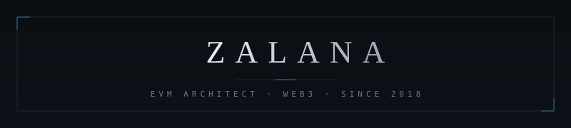
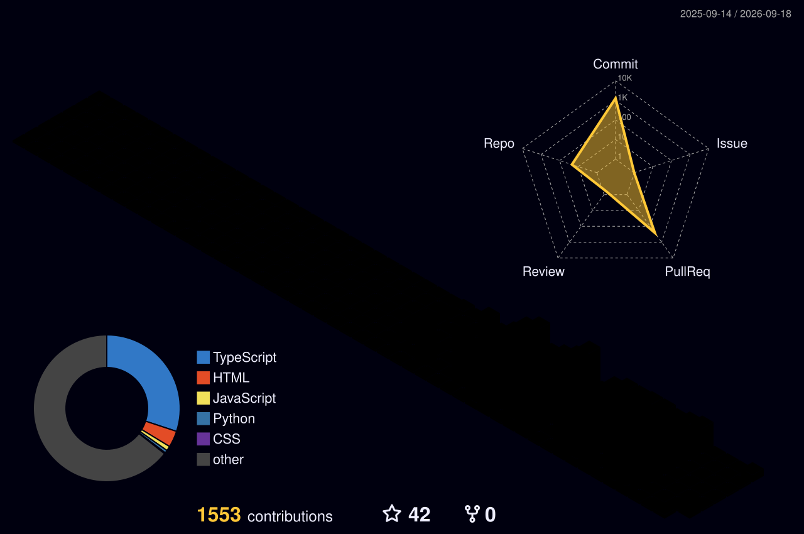

<div align="center">

  <!-- 1. CUSTOM ANIMATED CYBERPUNK HUD BANNER (HOSTED IN REPO) -->
  

  <!-- 2. ANIMATED AUDIO EQUALIZER / NOW PLAYING STATUS -->
  <p align="center">
    <a href="https://git.io/typing-svg">
      
    </a>
  </p>

</div>

---

### 💻 SYSTEM SPECS (NEOFETCH)

```zsh
  zalana@web3-dev ~ % neofetch --zalana
  --------------------------------------
  OS          : Web3 EVM Environment x86_64
  Host        : Decentralized Node v2026.1
  Uptime      : Active since 2018 (Crypto / Testnets / Ecosystem)
  Core Skills : Solidity, React, TypeScript, Wagmi, Viem, Next.js
  Shell       : zsh 5.9 (tokyo-night-cyber)
  Terminal    : iTerm2 / Alacritty
  Architecture: EVM Smart Contracts • Clean Architecture • dApps
  Mission     : "Architecting high-performance, secure, on-chain experiences."
```

---

### 🍱 BENTO DASHBOARD // TECH & METRICS

<table>
  <tr>
    <th width="50%" align="center">⚡ <b>CORE ARSENAL & SKILLS</b></th>
    <th width="50%" align="center">📊 <b>REAL-TIME DEV METRICS</b></th>
  </tr>
  <tr>
    <td valign="top">
      <br/>
      <b>🌐 Frontend Engineering:</b><br/>
      <br/><br/>
      <b>⛓️ Web3 & Smart Contracts:</b><br/>
      
      
      
      <br/><br/>
      <b>⚙️ Runtime, Tools & Cloud:</b><br/>
      
    </td>
    <td valign="top">
      <br/>
      
    </td>
  </tr>
</table>

---

### 📈 ACTIVITY VELOCITY

<div align="center">
  
</div>

---

### 🐍 ON-CHAIN CONTRIBUTION GRID (SNAKE EATER)

<div align="center">
  
</div>

---

### 🚀 FEATURED HIGHLIGHTS

| Project / Repository | Focus & Highlights | Tech Stack | Quick Links |
| :--- | :--- | :--- | :---: |
| ⚡ **Web3 Wallet Connection** | Eksperimen interaksi dApp, multi-wallet provider, dan pembacaan on-chain state. | `React` `TypeScript` `Wagmi` `Viem` | [View Repo ↗](https://github.com/zalana28) |
| 📜 **Solidity Smart Contracts** | Kumpulan latihan smart contract EVM dengan penekanan pada security & readable code. | `Solidity` `EVM` `Hardhat` | [View Repo ↗](https://github.com/zalana28) |
| 🧭 **Crypto Ecosystem Research** | Dokumentasi & riset mendalam seputar testnet, protokol DeFi, dan retroactive. | `Markdown` `Research` `Web3` | [View Repo ↗](https://github.com/zalana28) |

---

### 🛰️ TRANSMISSION & CLI CONNECT

<div align="center">

```bash
# Connect with Zalana via terminal / socials:
$ curl -s https://api.zalana.dev/contact
  ├── Twitter / X : https://x.com/zacxkzi
  ├── YouTube     : https://youtube.com/@zacxkzi
  ├── Instagram   : https://instagram.com/zacxkzi
  └── Email       : vanzaki28@gmail.com
```

<p align="center">
  <a href="https://x.com/zacxkzi" target="_blank">
    
  </a>
  &nbsp;
  <a href="https://youtube.com/@zacxkzi" target="_blank">
    
  </a>
  &nbsp;
  <a href="https://instagram.com/zacxkzi" target="_blank">
    
  </a>
  &nbsp;
  <a href="mailto:vanzaki28@gmail.com" target="_blank">
    
  </a>
</p>

<!-- Real-time Profile Views -->


<br/><br/>
<sub>⚡ "Decentralize everything, engineer without limits." // Built with cutting-edge HUD aesthetics.</sub>

---

### 🏙️ 3D ISOMETRIC CONTRIBUTION CITY

<div align="center">
  
</div>